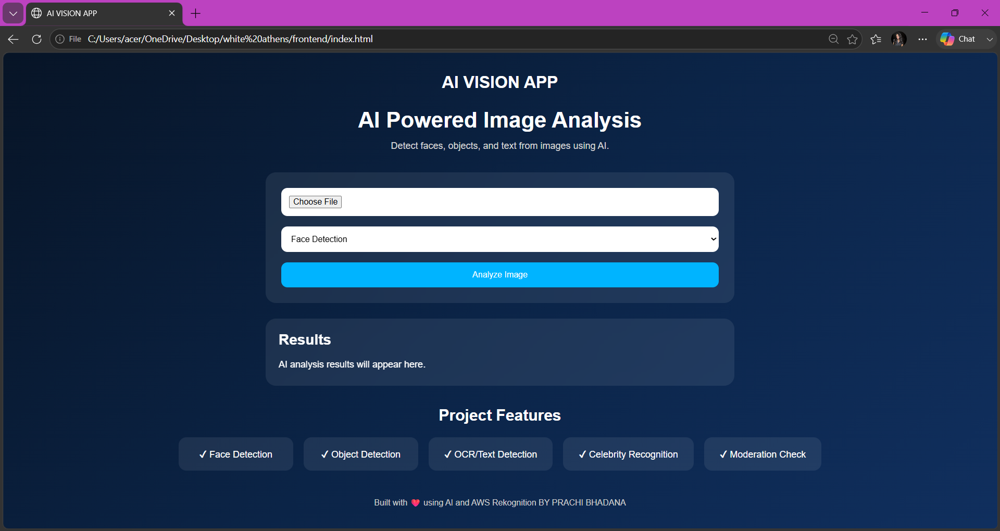
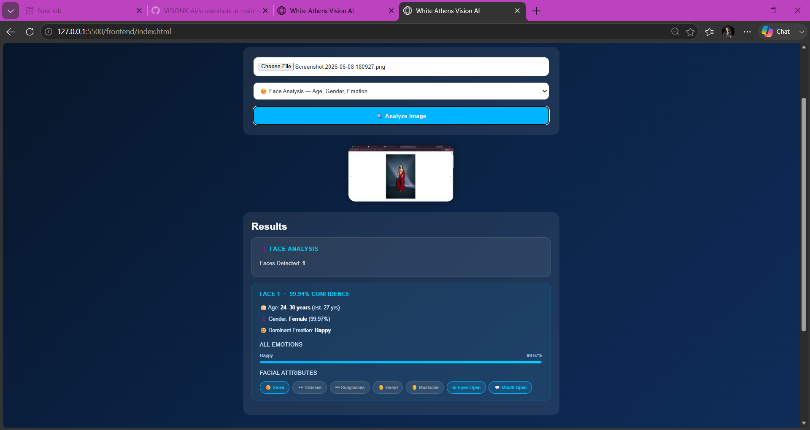
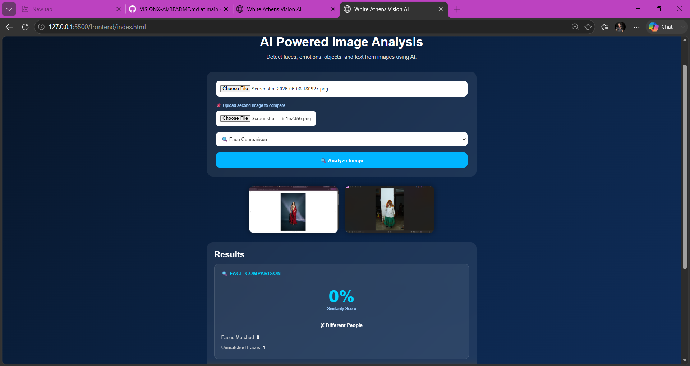
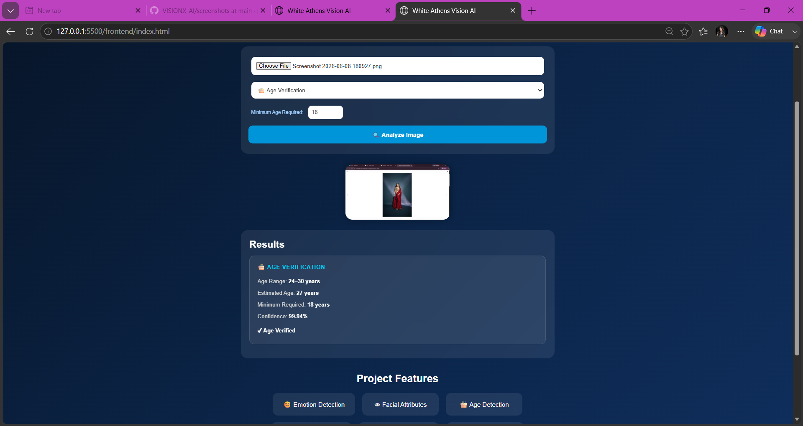
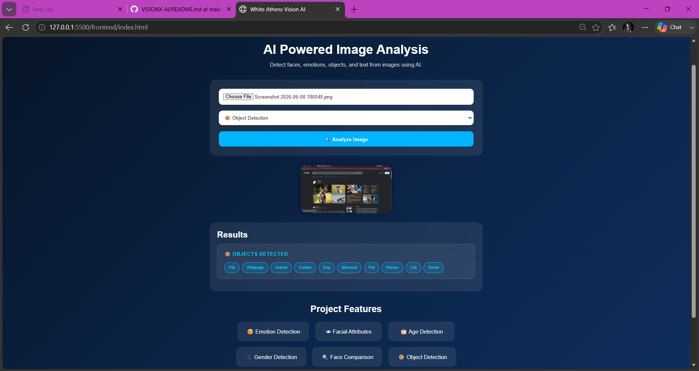
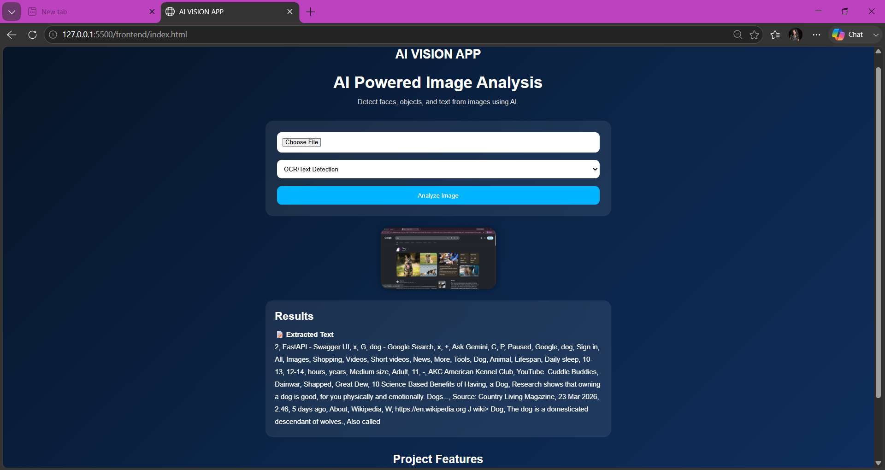
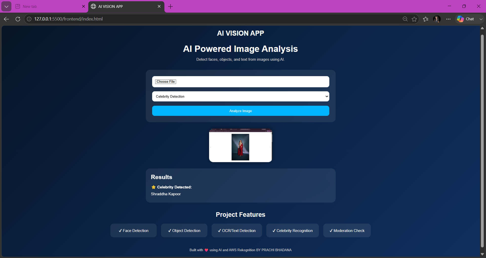
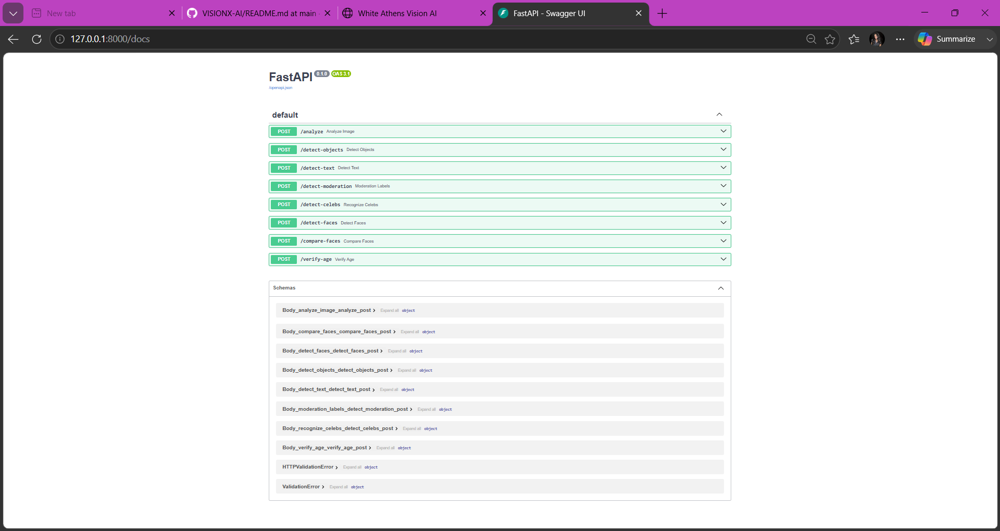

# VisionX-AI 🚀

AI-powered image analysis web application built using AWS Rekognition, FastAPI, HTML, CSS, and JavaScript.

---

## ✨ Features

| Feature | Description |
|---|---|
| 👤 Face Detection | Detects number of faces in an image |
| 😊 Emotion Detection | Detects emotions like Happy, Sad, Angry, Surprised, Calm |
| 🎂 Age Detection | Estimates age range of detected faces |
| 👤 Gender Detection | Identifies gender with confidence score |
| 👁 Facial Attributes | Detects smile, glasses, beard, mustache, eyes open, mouth open |
| 🔍 Face Comparison | Compares two faces and returns similarity percentage |
| 🎂 Age Verification | Verifies if a person meets a minimum age requirement |
| 📦 Object Detection | Detects objects present in the image |
| 📝 OCR / Text Detection | Extracts text from images |
| ⭐ Celebrity Recognition | Identifies celebrities in images |
| 🛡 Moderation Check | Detects harmful or explicit content |
| 🖼 Image Preview | Preview uploaded image before analysis |
| ⏳ Loading Animation | Shows loading state during analysis |
| ❌ Error Handling | Handles errors gracefully |
| 📱 Responsive Modern UI | Works on all screen sizes |

---

## 🛠 Tech Stack

**Frontend**
- HTML
- CSS
- JavaScript

**Backend**
- Python
- FastAPI

**Cloud & AI**
- AWS Rekognition

---

## 🏗 Project Architecture

```
Frontend → FastAPI Backend → AWS Rekognition → AI Analysis → Frontend Results
```

---

## 📸 Screenshots

### Main UI


### Face Analysis (Age, Gender, Emotion, Attributes)


### Face Comparison


### Age Verification


### Object Detection


### OCR / Text Detection


### Celebrity Recognition


### Backend API Running


---

## ⚡ How to Run

**1. Clone Repository**
```bash
git clone https://github.com/prachi-bhadana/VISIONX-AI.git
```

**2. Install Requirements**
```bash
cd backend
pip install -r requirements.txt
```

**3. Setup AWS Credentials**

Create `backend/aws_config.py`:
```python
AWS_ACCESS_KEY = "your-access-key"
AWS_SECRET_KEY = "your-secret-key"
AWS_REGION = "us-east-1"
```

**4. Run Backend**
```bash
uvicorn main:app --reload
```

**5. Open Frontend**

Run `frontend/index.html` using Live Server in VS Code.

---

## 🚀 Future Improvements

- Real-time camera analysis
- Voice assistant integration
- Cloud deployment
- AI memory systems
- Video analysis support
- Face search across database

---

## 👩‍💻 Author

**Prachi Bhadana**

Built with ❤️ using AWS Rekognition & FastAPI

[](https://github.com/prachi-bhadana/VISIONX-AI)
